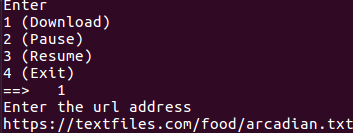

# README #

A Simple File downloading system.
### What is this repository for? ###

* Implementaion of a download manager which takes a url and downloads it with capability to pause and resume

### How do I get set up?

- Only software requirement is Python3

### Contents of repository ###

* ```main.py```  : Has the code for starting of the application.
* ```source.py```  :
* ```download_thread.py```  : Creates a thread which starts the downloading of the file.
* ```download_hepler.py``` : Keeps track of the downloading file 
* ```images/```  : Contains images required for README.md
* ```README.md``` : README for the repository
* ```downloads/``` : Contains the downloaded files.


### Sample Outputs




### Who Should I talk to ###

* Repo Owner 1: JAYAPRAKASH A
* Contact Details :
    - Email : 111501010@smail.iitpkd.ac.in
    - Phone number : +91-9497248284

* Repo Owner 2: POLU VARSHITH
* Contact Details :
    - Email : 111501020@smail.iitpkd.ac.in
    - Phone number : +91-9497243711

* Repo Owner 3: SST SIDDHARDHA
* Contact Details :
    - Email : 111501028@smail.iitpkd.ac.in
    - Phone number : +91-9497186069

